# Cloud Run browser use

## How it works

The app client send a POST request to a "Browser manager" service. The browser manager then returns a unique dedicated URL of a browser instance to the app client.

The app client then control commands to the unique URL is receives to control this specific instance. For example:

```
curl --header "Content-Type: application/json" \
  --request POST \
  --data '{"command":"navigate(url: https://en.wikipedia.org/wiki/Python)"}' \
  https://bfqjzim---browser-802583874831.us-central1.run.app/
```

## Benefits and trade-offs

pros:

* **The system is multi-tenant**: the app client can request many browsers, they all get a unique URL.
* **Serverless and simple**: All pieces scale to zero and can be deployed as 2 simple Cloud Run services.

cons:

* **Limit of 1000** browser per browser manager (because each browser is a revision).
* **No strong session duration promise**: Instances of Cloud Run services can be restarted at any time, even if requests are sent to them. This notably happens during infrastrucrture upgrades. Services do not *yet* support live migration whcih would allow to migrate memory state (the Cloud Run team needs to prioritize this work). In practise, it's very likely that instance lifespan is "good enough" for most developers and SLOs woudl be acceptable. 

## Architecture



## Deploy it

### Before you begin

Create a GCP project and install the [Google Cloud SDK](https://cloud.google.com/sdk/docs/install).

```bash
# Set the project ID
export PROJECT_ID=your-project-id
# Set the project number
export PROJECT_NUMBER=$(gcloud projects describe $PROJECT_ID --format='value(projectNumber)')
# Set the region
export REGION=us-central1
```

### Deploy Browser manager API

```bash
# Deploy from source to Cloud Run (in the future, this will be delivered as a pre-built container)
gcloud alpha run deploy browser-manager \
  --source . \
  --no-invoker-iam-check \
  --region $REGION \
  --project $PROJECT_ID
```


### Deploy Browser API

```bash
# Navigate to the browser directory
cd ../workers/puppeteer

# Create new Service account with 0 permissions
gcloud iam service-accounts create browser \
  --description="Service account for browser" \
  --display-name="browser" \
  --project $PROJECT_ID 

# Deploy from source to Cloud Run (in the future, this will be delivered as a pre-built container)
gcloud alpha run deploy browser \
  --source . \
  --cpu 4 \
  --memory 8Gi \
  --min-instances 1 \
  --max-instances 1 \
  --execution-environment gen2 \
  --timeout 3600 \
  --service-account=browser@$PROJECT_ID.iam.gserviceaccount.com \
  --no-deploy-health-check \
  --no-invoker-iam-check \
  --region $REGION \
  --project $PROJECT_ID

# Give browser manager permission to update the browser service
gcloud run services add-iam-policy-binding browser \
  --member=serviceAccount:$PROJECT_NUMBER-compute@developer.gserviceaccount.com \
  --role=roles/run.developer \
  --region $REGION \
  --project $PROJECT_ID

# Give browser manager permission to act as the service account "browser"
gcloud iam service-accounts add-iam-policy-binding browser@$PROJECT_ID.iam.gserviceaccount.com \
  --member=serviceAccount:$PROJECT_NUMBER-compute@developer.gserviceaccount.com \
  --role=roles/iam.serviceAccountUser \
  --project $PROJECT_ID
```
 